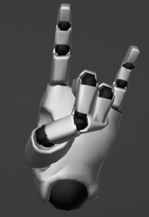
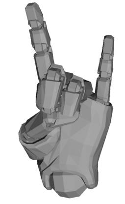
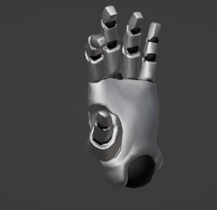

# Visualizer

Handshapes can be generated using the module "viz.py" in the visualization folder. Running `python example.py` shows its usage.

## Requirements

Blender installed and in path. Check "blender --version" in command prompt.

## Static Gestures

example.py shows how to visualize static gestures (see function static_gesture_visualization_example()). Either static files with three gestures each can be used as input or directly joint angle values as a list for a single gesture:

```python
static_viz = StaticDataVisualizer()

# Generate a single sample (label, hand, values, export_file_type)
static_viz.generate_static_gesture_from_sample('faust', 'Left', sample_values, 'stl')

# Generate multiple samples from file (file_path, export_file_type)
static_viz.generate_static_gesture_from_file(file_path, 'stl')
```

At the moment static handshapes can be exported as .stl, .blend or .obj files. The last two can be easily visualized using Blender.

The simplest way is to generate STL files and visualize them interactively here: https://www.viewstl.com/ <br />
Example (Blender):<br />
<br />
Example (STL):<br />


## Dynamic Gestures

example.py shows how to visualize dynamic gestures (see function dynamic_gesture_visualization_example()). The dynamic .json files are used as input.

```python
dynamic_viz = DynamicDataVisualizer()

input_json_path = R"../processed/5/processed_data.json"

dynamic_viz.generate_dynamic_gesture(input_json_path, export=True)  # save result as file
dynamic_viz.generate_dynamic_gesture(input_json_path, export=False)  # or show result directly
```

The output will be a blender file with the respective gesture animation for the START, HOLD and END PHASES. In Blender use space to start the animation.<br />
Example ('j' gesture):<br />
 <br />

**Note**<br />
The 'z' gesture only changes in position in the time interval and does not change either joint angle values or wrist/hand rotation. Since the position information is not available, the animation stays relatively motionless.<br />
Possibly other dynamic gestures can be visualized in the future that incorporate either varying joint angles or wrist/hand rotations or both for the best visual effect.
